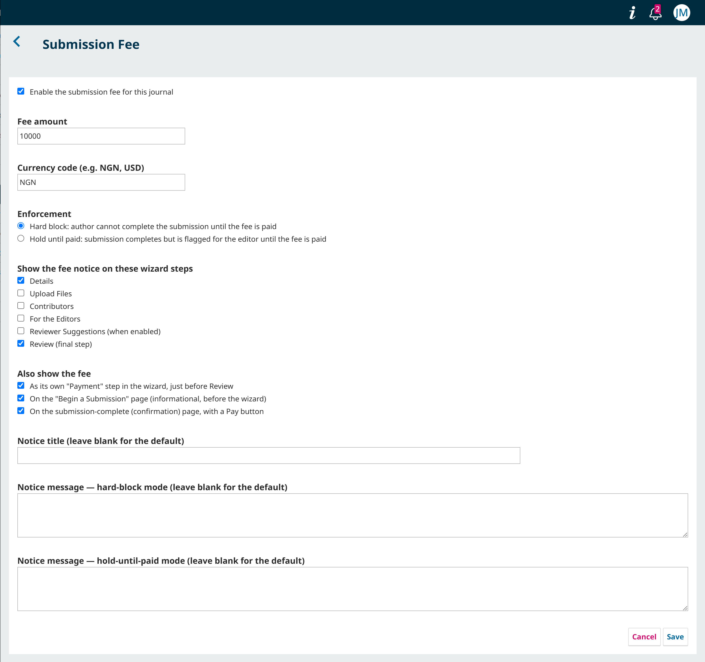
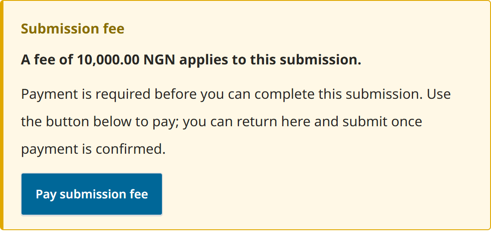
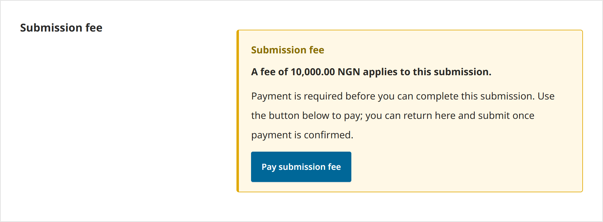
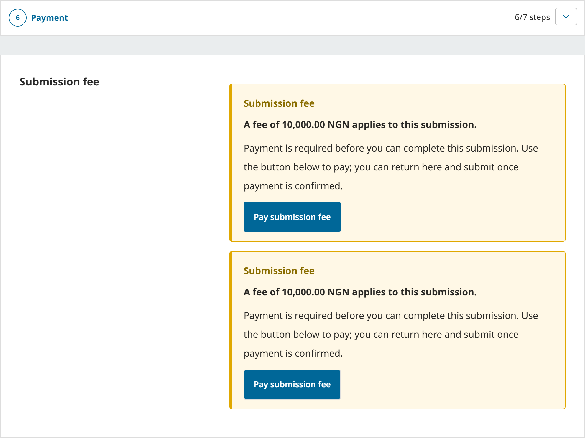
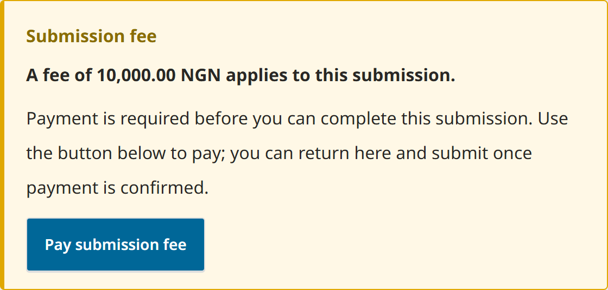

# Submission Fee — OJS 3.5 submission-time fee plugin

Charges an author a fee **at submission time**, collected through the journal's
existing payment method plugin (e.g. a Paystack / Flutterwave / MultiPay gateway).
OJS 3 ships only a *publication* fee (charged on/after acceptance); this plugin
reintroduces a submission-time fee **without forking core** — it uses OJS hooks
and the native payment subsystem only.

- **Compatibility:** OJS 3.5.0.0 – 3.5.0.3
- **Licence:** GNU GPL v3 (see `LICENSE`)
- **Type:** `plugins.generic`

## How it works

The plugin reuses the native OJS payment subsystem (`OJSPaymentManager`,
`QueuedPayment`, `OJSCompletedPaymentDAO`) with the built-in
`PAYMENT_TYPE_SUBMISSION` constant, plus whatever payment method plugin the
journal has enabled.

Two enforcement modes (Settings):

- **Hard block** (default): an author cannot finish the submission wizard until a
  completed payment exists for that submission. Enforced server-side via the
  `Submission::validateSubmit` hook, so it does not depend on the Vue wizard
  markup and survives minor upgrades. The validation error includes a pay link.
- **Hold until paid**: the submission completes normally; the fee is queued on
  the `SubmissionSubmitted` event and the submission is flagged
  `submissionFeeOutstanding` for the editor.

In **both** modes, a fee notice with a **Pay submission fee** button is shown in
the submission wizard's **Review** step. This is injected through the native
`Template::SubmissionWizard::Section::Review` hook — no Vue build and no theme
template edits, so it works on a default install and is upgrade-safe.

The author pays via `/{journal}/submissionFee/pay/{submissionId}`, which queues
the payment and calls `PaymentManager::displayPaymentForm()` — that hands off to
the configured gateway plugin. On gateway callback the paymethod plugin calls
`fulfillQueuedPayment()`, which records the completed payment; the hard-block
check (and the notice) then clear.

## Install

1. Place this folder at `plugins/generic/submissionFee` (or install the release
   archive via **Settings → Website → Plugins → Upload A New Plugin**).
2. **Settings → Website → Plugins** → enable **Submission Fee**.
3. Clear the cache (listeners/locales are cached):
   `php lib/pkp/tools/clearCache.php` and remove `cache/t_compile/*`.
4. Plugin row → **Settings**: tick enable, set amount, currency, and mode.
5. Ensure a payment method plugin (your gateway) is enabled under
   **Distribution → Payments**, and that Payments is turned on.

## Configuration

| Setting | Description |
|---------|-------------|
| Enable | Turns the submission fee on for this journal. |
| Fee amount | Numeric amount (> 0). |
| Currency | ISO-4217 code (e.g. `NGN`, `USD`). Falls back to the journal's configured payment currency, then `NGN`. |
| Enforcement | `Hard block` or `Hold until paid` (see above). |

## Verification checklist

- Enable, set fee, mode = **hard block**. Start a submission and open the
  **Review** step → the fee notice + **Pay submission fee** button appears.
- Click **Submit** → you are blocked with the pay message + link.
- Follow the pay link → land in your gateway → pay (sandbox) → return.
- Click **Submit** again → it now goes through, and the notice is gone.
- Switch to **hold until paid**: completing the wizard succeeds and creates a
  queued payment + `submissionFeeOutstanding` flag; the Review notice still
  offers a proactive pay link until paid.

## Compatibility notes (worth confirming against your exact 3.5.x)

- **`Submission::validateSubmit`** arg order is `[&$errors, $submission, $context]`
  (stable in 3.5).
- **`SubmissionSubmitted`** event lives at
  `lib/pkp/classes/observers/events/SubmissionSubmitted.php`.
- **`Template::SubmissionWizard::Section::Review`** hook is declared in
  `lib/pkp/templates/submission/wizard.tpl`.
- **`displayPaymentForm()` / payment routing.** If your gateway registers its own
  page op instead of going through the core payment handler, change
  `PaymentHandler::pay()` to redirect to that gateway URL with the queued payment
  id.

## Known limitations

- **Editor UI visibility.** In *hold until paid* mode the plugin sets a
  `submissionFeeOutstanding` flag on the submission. OJS core has no native UI
  element for this flag in the editor dashboard; editors should check the
  **Payments** grid (or a custom dashboard column) to see outstanding fees.
- **Abandoned payments.** If an author abandons the gateway flow, the queued
  payment remains until it expires (standard OJS behaviour). The author can
  re-initiate from the Review-step notice or the pay link.

## Releasing / packaging (for distribution)

Following the [PKP plugin release guide](https://docs.pkp.sfu.ca/dev/plugin-guide/en/release):

1. Bump `<release>` and `<date>` in `version.xml`, update `CHANGELOG.md`.
2. Tag the commit (e.g. `git tag v1.1.0.0 && git push --tags`).
3. Build the archive with the plugin folder at the top level:
   ```
   tar -czf submissionFee-1.1.0.0.tar.gz \
       --exclude-vcs --exclude='*.tar.gz' submissionFee/
   ```
4. Attach the archive to the GitHub release for the tag.
5. (Optional) Submit to the OJS Plugin Gallery per the PKP guide.

The archive must contain a single top-level `submissionFee/` directory so OJS's
**Upload A New Plugin** installer places it correctly.

## Screenshots

| | |
| --- | --- |
| Settings |  |
| Wizard banner |  |
| Dedicated Payment step |  |
| Step list |  |
| Confirmation page |  |
